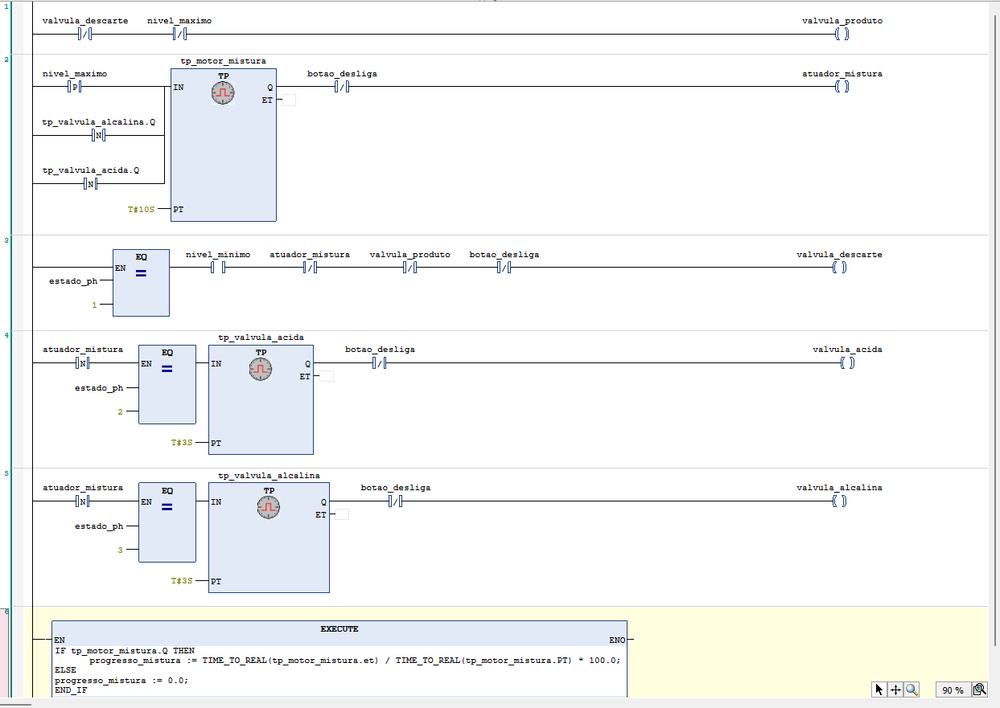
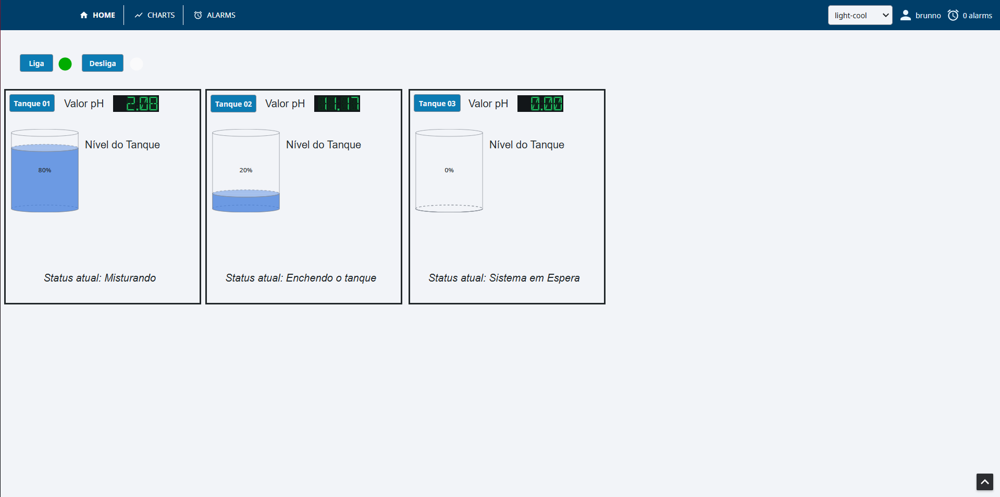
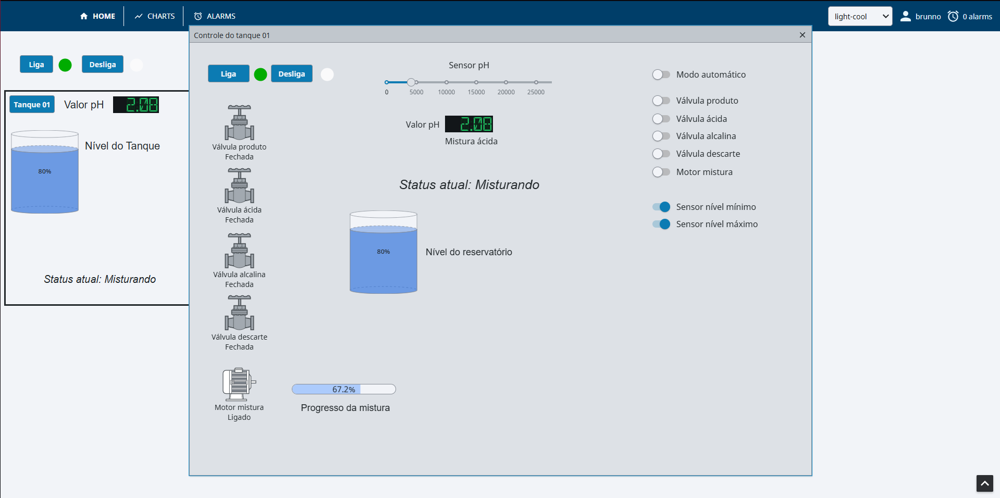
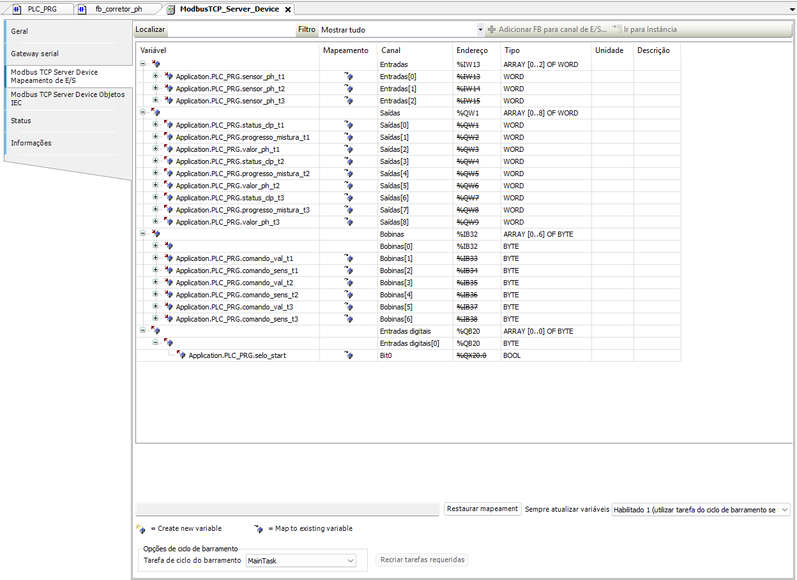
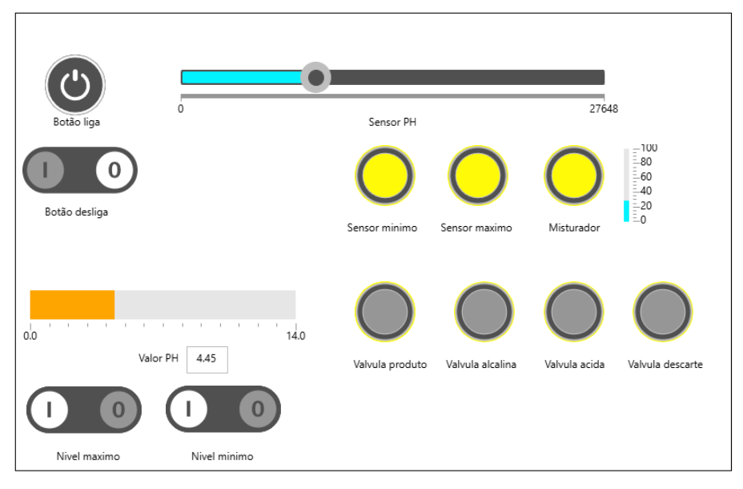
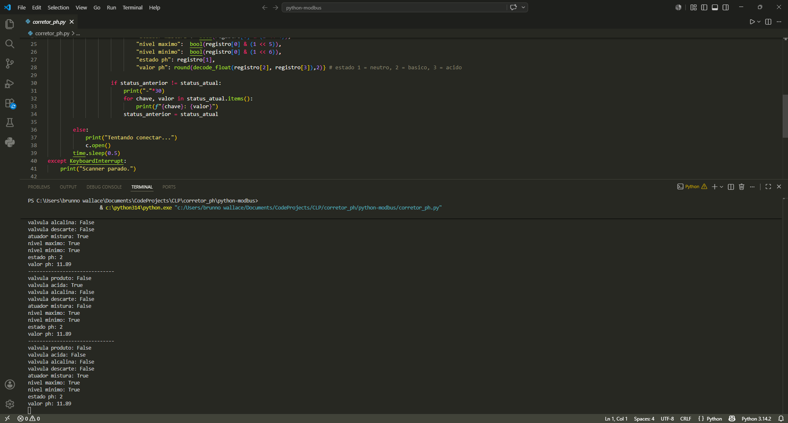
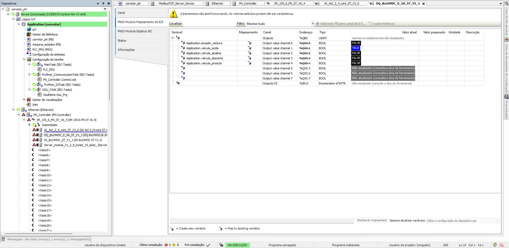

Sistema de correção de pH - CODESYS & IHM & Mini-SCADA Python
 
Este projeto visa criar um corretor de misturas ácidas e alcalinas através de sensores analógicos/digitais com uma IHM. Além disso, foram integrados os protocolos PROFINET para o envio e aquisição de dados para
uma remota e ModbusTCP para a requisição de dados.

Requisitos de Hardware:
- Sensores/Atuadores: Sensor de presença de nível mínimo e máximo, sensor analógico de pH, válvulas e motores como atuadores.

Funcionamento:
1. É aberta a válvula do produto até que o sensor de nível máximo envie um sinal de que
o tanque principal está cheio.
2. O motor de misturar é ligado por 10 segundos para mexer a mistura do tanque.
3. É medido o pH da mistura através da entrada analógica.
4. Se o pH for menor que 6,5 segue para o passo 5. Caso contrário, se o pH for maior
que 7,5 segue para o passo 6. Caso contrário, se o pH for maior que 6,5 e menor que
7,5 então segue ao passo 7.
5. É aberta a válvula da mistura Alcalina por 3 segundos e volta ao passo 2.
6. É aberta a válvula da mistura ácida por 3 segundos e volta ao passo 2.
7. É aberta a válvula para descarte da solução até que o sensor de nível mínimo detecte
que não há mais líquido. Em seguida o processo é reiniciado.
8. Há um botão para a escolha do modo automático ou manual. Se o modo manual for ativado, o operador assume o controle e pode atuar diretamente nas válvulas e no misturador através da IHM.

Funcionalidades:
- Lógica Ladder: Quando o botão de ligar é acionado, a válvula para encher o tanque é acionada até o sensor de nível máximo indicar o fim, iniciando o processo de mistura.
O sensor analógico de pH é utilizado no bloco SCALE_R para converter o sinal em um valor dentro da escala 0-14. Após a leitura e transformação de escala, a máquina de estados indica se é necessário ligar as válvulas alcalina ou ácida e inicia-se uma nova mistura.
O processo se repete até o produto estar com pH entre 6.5 e 7.5 para assim ser descartado.

<<<<<<< HEAD
- Interface Homem-Máquina - Ignition SCADA (Perspective):
O monitoramento e controle da planta foram implementados utilizando o **Ignition Maker Edition (Módulo Perspective)**, seguindo os preceitos de IHM de Alta Performance.
1. Arquitetura Modular: Utilização de UDTs (User-Defined Types) para representar os motores, válvulas e sensores, permitindo a escalabilidade para múltiplos tanques simultâneos.
2. Templates e Popups Dinâmicos: Criação de *Embedded Views* parametrizadas e *Indirect Tag Bindings*. A tela principal exibe um Dashboard limpo de Consciência Situacional, onde o operador monitora o processo global e abre popups focados apenas quando há necessidade de intervenção manual no equipamento.
3. Lógica de Status Front-end: Utilização de *Expression Structures* combinadas com *Script Transforms* (Python) para derivar o status textual do processo ("Misturando", "Enchendo", "Corrigindo pH") lendo diretamente o feedback dos atuadores na tela.

- Integração Modbus TCP: Conexão direta e bidirecional com os registradores `%IW` e `%QW` do CODESYS, gerenciando as variáveis de entrada e saída de acordo com os tipos de dados.

=======
- Interface Homem-Máquina: Interface para o monitoramento do programa. Nela estão presentes LEDs para indicar quando um sensor ou atuador está ativo e uma barra de preenchimento vertical para indicar o tempo restante do misturador. Além disso, um contador indica quantas misturas já foram concluídas.

- Protocolo ModbusTCP & Python: Comunicação entre o CLP e um programa python. O protocolo ModbusTCP e a biblioteca pymodbusTCP foram utilizados para o monitoramento de dados. Quando há alguma alteração entre as válvulas ou sensores, o python detecta e imprime os estados atuais no terminal.

- Protocolo Profinet: Foi simulado uma remota com o intuito de testar a comunicação através do protocolo Profinet. Diferentes tipos de entradas e saídas (analógicas e digitais) foram mapeadas para que o protocolo pudesse enviar e receber dados sobre os sensores e atuadores.

Tecnologias
- CODESYS V3.5 (SoftPLC)
- Profinet
- ModbusTCP
- Python
>>>>>>> 90a0a4bb8ea5b6fe4914f844301b3dfd79e1add7

Tecnologias Utilizadas
- CODESYS V3.5: Programação CLP e Modbus TCP Server
- Ignition Perspective: Sistema SCADA modular e responsivo
- Modbus TCP: Protocolo de comunicação industrial
- Python / Jython: Scripts de interface e transformações de dados no SCADA
---
*Projeto desenvolvido para consolidar conhecimentos em programação de CLPs.*
